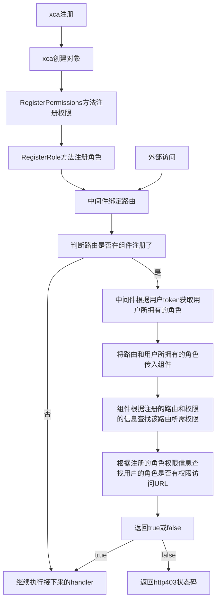

## 应用场景和注意事项

- 主要用于http中间件，校验该角色用户是否有对应的URL资源权限。
- 一个用户可以拥有多个角色，一个URL资源可以授权多个角色。
- 使用前需要建2个表URL权限表和角色权限表，这2个表的增删改需要自己维护。


## 流程



## 接口

```golang
type AuthorityManager interface {
	// 注册url和权限的关系  permissionsMap map[string]string{"url":"权限标识"}
	RegisterPermissions(permissionsMap map[string]string)
	// 修改url和权限的关系,这里是替换，不是追加， url:url; permissions:权限标识
	UpdatePermissions(url string, permissions string)
	// 注册角色和权限的关系 roleMap map[string][]string{"角色名字": []string{"权限标识1","权限标识2"}}
	RegisterRole(roleMap map[string][]string)
	// 修改角色和权限标识的关系,这里是替换，不是追加  role:角色名字, permissions:[]string{"权限标识1","权限标识2"}
	UpdateRole(role string, permissions []string)
	// 权限认证 在路由层去认证 ， url:url, userRole:[]string{"用户拥有的角色名字1","用户拥有的角色名字2"}
	PermissionsCheck(url string, userRole []string) bool
	// 获取角色列表  map[string][]string{"角色名字":[]string{"权限标识1","权限标识2"}}
	GetRoleMap() map[string][]string
	// 获取权限列表   map[string]string{"URL":"权限标识"}
	GetPermissionsMap() map[string]string
	// iris权限校验中间件
	IrisPermissionsCheck(ctx iris.Context)
}
```


### RegisterPermissions

`RegisterPermissions(permissionsMap map[string]string)`

作用:注册url和权限的关系

#### 传入参数:

permissionsMap:map[string]string{"url":"权限标识"}

#### 返回参数


### UpdatePermissions

`UpdatePermissions(url string, permissions string)`

作用:修改url和权限的关系,这里是替换，不是追加， 

#### 传入参数:

url:url

permissions:权限标识

#### 返回参数


### RegisterRole

`RegisterRole(roleMap map[string][]string)`

作用:注册角色和权限的关系

#### 传入参数:

roleMap:map[string][]string{"角色名字": []string{"权限标识1","权限标识2"}}

#### 返回参数


### UpdateRole

`UpdateRole(role string, permissions []string)`

作用:修改角色和权限标识的关系,这里是替换，不是追加

#### 传入参数:

role:角色名字

permissions:[]string{"权限标识1","权限标识2"}

#### 返回参数


### PermissionsCheck

`PermissionsCheck(url string, userRole []string) bool`

作用：权限认证 在路由层去认证

#### 传入参数:

url:url

userRole:[]string{"用户拥有的角色名字1","用户拥有的角色名字2"}

#### 返回参数


### GetRoleMap

`GetRoleMap() (roleMap map[string][]string)`

作用：获取角色列表

#### 传入参数:


#### 返回参数

roleMap:map[string][]string{"角色名字":[]string{"权限标识1","权限标识2"}}


### GetPermissionsMap

`GetPermissionsMap() (permissionsMap map[string]string)`

作用:获取权限列表

#### 传入参数:


#### 返回参数

permissionsMap:map[string]string{"URL":"权限标识"}

### IrisPermissionsCheck

`IrisPermissionsCheck(ctx iris.Context)`

作用:Iris中间件，`需要在前面的中间件中定义用户角色 ctx.Values().Set("userRole", []string{"用户角色"})`

#### 传入参数:

ctx:iris上下文


#### 返回参数


## 待完善


### 1.目前角色管理和url权限管理无web页面

### 2.目前接口权限校验没区分http Method

欢迎大家交流使用,如有问题，请大家及时指正，联系邮箱 [zousf@novastar.tech](mailto:zousf@novastar.tech)
